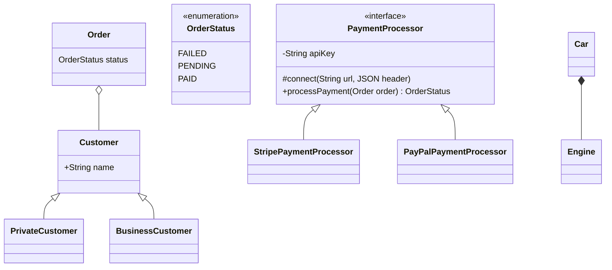

# Mermaid Tutorial - Class

Let's go!

class 1

```mermaid
classDiagram
    class Order {
        OrderStatus status
    }

    class OrderStatus {
        <<enumeration>>
        FAILED
        PENDING
        PAID
    }

    class PaymentProcessor {
        <<interface>>
        -String apiKey
        #connect(String url, JSON header)
        +processPayment(Order order) OrderStatus
    }

    class Customer {
        +String name
    }

    Customer <|-- PrivateCustomer
    Customer <|-- BusinessCustomer
    PaymentProcessor <|-- StripePaymentProcessor
    PaymentProcessor <|-- PayPalPaymentProcessor
    Order o-- Customer
    Car *-- Engine
```