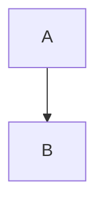
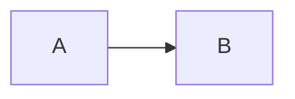
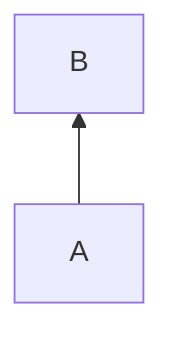
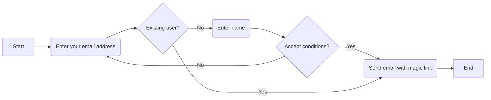

# Mermaid Tutorial - Flowchart

Let's go!

flowchart 1

```mermaid
flowchart
    A --> B
```

flowchart 2: Left->Right

```mermaid
flowchart LR
    A --> B
```

flowchart 3: Bottom->Top

```mermaid
flowchart BT
    A --> B
```

flowchart 4

```mermaid
flowchart LR
    S[Start] --> A;
    A(Enter your email address) --> B{Existing user?};
    B --> |No| C(Enter name);
    C --> D{Accept conditions?};
    D --> |No| A;
    D --> |Yes| E(Send email with magic link);
    B --> |Yes| E;
    E --> End;
```